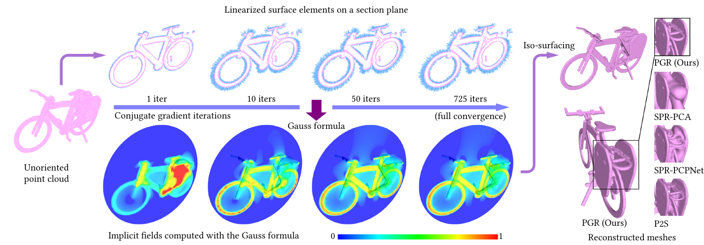

# Parametric Gauss Reconstruction (PGR)

## Update (2024/09/12): 

- Check out our newest update to PGR here: [WNNC](https://github.com/jsnln/WNNC):
  - Much lower complexity and higher efficiency: O(N^3) => O(NlogN) and can handle millions of points
  - Much better normal accuracy
  - PyTorch interfaces that are easy to use
  - Unofficial implementations of [GaussRecon](https://dl.acm.org/doi/10.1145/3233984) as a by-product, faster and more noise-resilient to the mainstream [PoissonRecon](https://github.com/mkazhdan/PoissonRecon).


This repository contains the implementation of the paper:

[**Surface Reconstruction from Point Clouds without Normals by Parametrizing the Gauss Formula (ACMTOG 2022)**](https://dl.acm.org/doi/10.1145/3554730)

*[Siyou Lin](https://jsnln.github.io/), Dong Xiao, [Zuoqiang Shi](https://shizqi.github.io/), [Bin Wang](https://binwangthss.github.io/)*

[Project page](https://jsnln.github.io/tog2022_pgr/index.html) | [Slides (SIGGRAPH 2023)](https://jsnln.github.io/tog2022_pgr/assets/pgr-pre.pdf)



*Parametric Gauss Reconstruction (PGR)* takes an unoriented point cloud as input and solves an equation where the normals are the unknowns. The equation is written with the Gauss formula from potential theory, which can be established using only the coordinates of surface point samples. Upon obtaining the solution, PGR further computes an implicit indicator field for extracting the mesh surface.   

## Instructions on Running the Program

### Environment and Dependencies

This program has been tested on Ubuntu 20.04 with Python 3.8 and CUDA 11.1.  This program requires these Python packages: `numpy`, `cupy`, `scipy` and `tqdm`.

### Compiling Source Files

This program uses third-party libraries [CLI11](https://github.com/CLIUtils/CLI11) and [cnpy](https://github.com/rogersce/cnpy). We provide copies of them in this repository for convenicence. If you have [cmake](https://cmake.org/), you can build with:

```bash
mkdir build
cd build
cmake ..
make -j8
```

Or you can also build with `g++` directly:

```bash
cd src
g++ PGRExportQuery.cpp Cube.cpp Geometry.cpp MarchingCubes.cpp Mesh.cpp Octnode.cpp Octree.cpp ply.cpp plyfile.cpp cnpy/cnpy.cpp -ICLI11 -o ../apps/PGRExportQuery -lz -O2
g++ PGRLoadQuery.cpp Cube.cpp Geometry.cpp MarchingCubes.cpp Mesh.cpp Octnode.cpp Octree.cpp ply.cpp plyfile.cpp cnpy/cnpy.cpp -ICLI11 -o ../apps/PGRLoadQuery -lz -O2
```

If successful, this will generate two executables `PGRExportQuery` and `PGRLoadQuery` in `ParametricGaussRecon/apps`. The former builds an octree and exports grid corner points for query; the latter loads query values solved by PGR and performs iso-surfacing.

### Run the All-in-one Script

We provide a script `run_pgr.py` to run the complete pipeline. Usage:

```
python run_pgr.py point_cloud.xyz [-wk WIDTH_K] [-wmax WIDTH_MAX] [-wmin WIDTH_MIN]
                  [-a ALPHA] [-m MAX_ITERS] [-d MAX_DEPTH] [-md MIN_DEPTH]
                  [--cpu] [--save_r]
```

Note that `point_cloud.xyz` should __NOT__ contain normals. The meaning of the options can be found by typing

````
python run_pgr.py -h
````

We provide in `data` directory some example point clouds (from dense to sparse, depending on your accessible computation resources). We recommend running with ~40k points on GPU, which takes about one minute on RTX3090 and uses ~8GB GPU memory:

```bash
python run_pgr.py data/Armadillo_40000.xyz		# 8GB memory, 1 min
```

This will create a folder `results/Armadillo_40000` together with three subfolders: `recon`, `samples` and `solve` :

- `recon` contains the reconstructed meshes in PLY format.
- `samples` contains the input point cloud in XYZ format, the normalized input point cloud and the octree grid corners as query set in NPY format.
- `solve` contains the solved Linearized Surface Elements in XYZ and NPY formats, the queried values, query set widths in NPY format, and the iso-value in TXT format.

With fewer samples, you can use larger alpha and k for better smoothness (meanwhile, computation cost becomes much smaller):

```bash
python run_pgr.py data/bunny_20000.xyz --alpha 1.2 -wk 16	# 2.8 GB, 12 sec
python run_pgr.py data/bunny_10000.xyz --alpha 1.2 -wk 16	# 1.2 GB, 5 sec
```

With sparse samples (<5k), we recommend using a large constant width by setting `--width_min`:

```bash
python run_pgr.py data/Utah_teapot_5000.xyz --alpha 2 -wmin 0.04	# 700 MB, 1.7 sec
```

Moreover, sparse inputs allow running on CPU (using `--cpu`) within acceptable time:

```bash
python run_pgr.py data/Utah_teapot_5000.xyz --alpha 2 -wmin 0.04 --cpu	# 67 sec
python run_pgr.py data/Utah_teapot_3000.xyz --alpha 2 -wmin 0.04 --cpu	# 19 sec
python run_pgr.py data/Utah_teapot_1000.xyz --alpha 2 -wmin 0.04 --cpu	# 1.6 sec
```


## Pipeline Explained

The pipeline is divided into three stages: `PGRExportQuery`, `PGRSolve` and `PGRLoadQuery`. The script `run_pgr.py` runs all three steps. For clarity, we explain each in detail. 

### Exporting Query

Usage:

```bash
./apps/PGRExportQuery -i point_cloud.xyz -o out_prefix [-m minDepth] [-d maxDepth]
```

This takes `point_cloud.xyz` as input and builds an adaptive octree. It outputs two files:

- `out_prefix_for_query.npy`: the grid corners on the octree for query.
- `out_prefix_for_normalized.npy`: normalized points from the input point cloud.

### Solving for the Implicit Field (Main)

Usage:

```bash
python -m apps.PGRSolve [-h] -b BASE -s SAMPLE -q QUERY -o OUTPUT
						 -wk WIDTH_K -wmin WIDTH_MIN -wmax WIDTH_MAX
						 -a ALPHA
						[--max_iters MAX_ITERS] [--save_r] [--cpu]
```

Explanation of options:

- `BASE`: the point set $\mathcal{Y}=\mathcal{P}$ for determining basis functions, stored in NPY format.
- `SAMPLE`: the point set $\mathcal{X}=\mathcal{P}$ for listing equations, stored in NPY format.
- `QUERY`: the point set $\mathcal{Q}$ of octree grid corners for field queries, stored in NPY format.
- `OUTPUT`: the output prefix

Other options are straight forward. One can use

```bash
python -m apps.PGRSolve -h
```

to check the help message.

This program outputs (`OUTPUT` is the argument corresponding to `-o`):

- `OUTPUT_eval_grid.npy`: queried values of octree grid corners.
- `OUTPUT_grid_width.npy`: width function values of octree grid corners.
- `OUTPUT_isoval.txt`: isovalue.
- `OUTPUT_lse.npy`: solved linearized surface elements in NPY format.
- `OUTPUT_isoval.txt`: solved linearized surface elements in XYZ format, can be opened as an oriented point cloud.

### Loading Queries and Iso-surfacing

Usage:

```bash
./apps/PGRLoadQuery -i point_cloud.xyz -o out_mesh.ply
					--grid_val grid_query.npy --grid_width grid_width.npy
					[-m minDepth] [-d maxDepth] [--isov iso_val]
```

where

- `point_cloud.xyz` is the unnormalized point cloud.
- `grid_query.npy` and `grid_width.npy` are the output from the last stage.

The meanings of other options should be straight-forward.

## Related Research

[Surface Reconstruction Based on the Modified Gauss Formula  (ACMTOG 2019)](https://doi.org/10.1145/3233984)
Wenjia Lu, Zuoqiang Shi, Jian Sun,  Bin Wang

